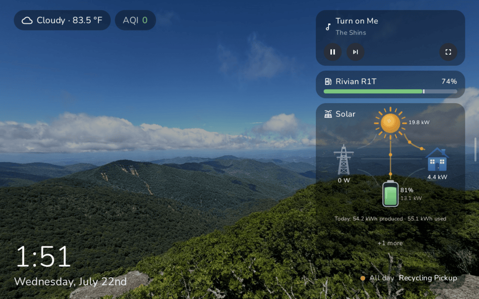
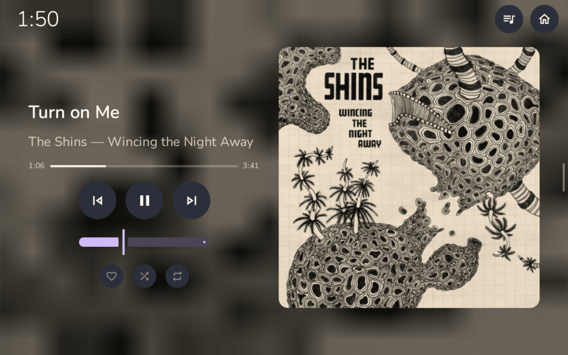
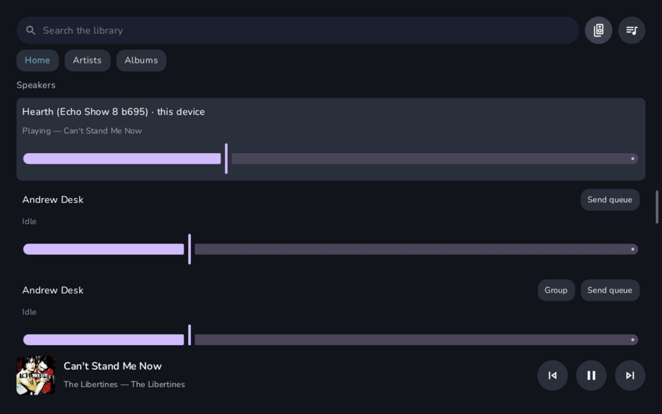
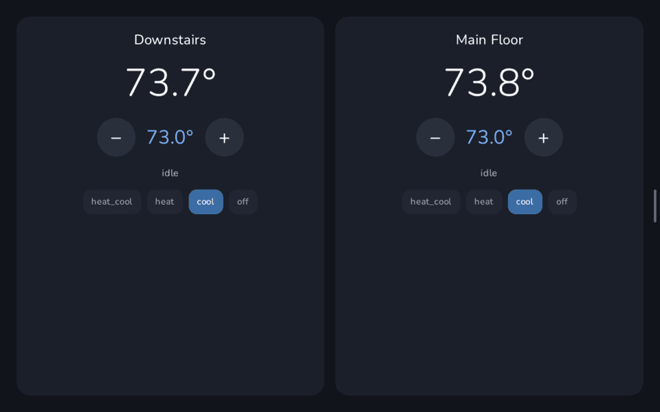
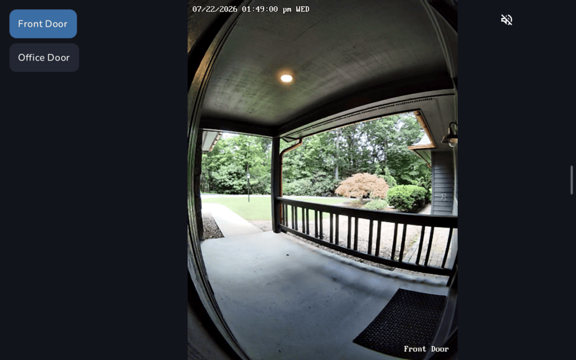
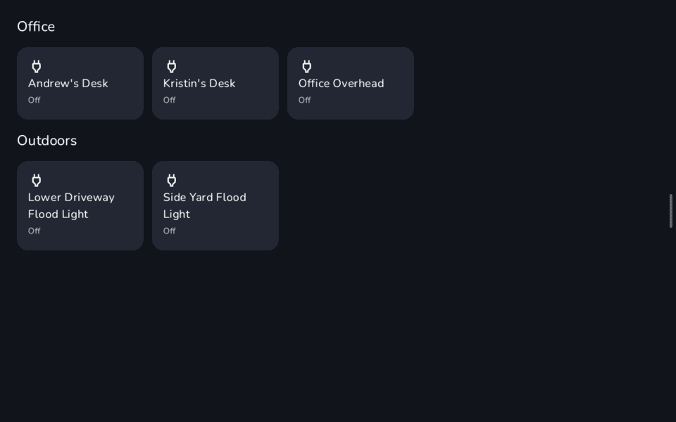

<p align="center">
  
</p>

<h1 align="center">Hearth</h1>

A native Android wall-dashboard for Home Assistant, plus its own HA integration.

- **The app** (`app/`): a Kotlin + Jetpack Compose kiosk that turns an Android device into an always-on HA dashboard and voice satellite. Born on a LineageOS Echo Show 5, now happily multi-device. Everything is configured from a web page the device serves on your LAN — no YAML.
- **The integration** (`custom_components/hearth/`): a slim custom integration that gives HA full control of each device — media player, screen, brightness, toasts, TTS announcements.

## Screenshots

<em>Running on an Echo Show 8.</em>

<table>
  <tr>
    <td width="50%"><br/><sub><b>Home</b> — weather/AQI pills, mini now-playing card, EV charge, animated solar flow, next-event chip.</sub></td>
    <td width="50%"><br/><sub><b>Now-playing takeover</b> — full album art, seek slider, shuffle/repeat, favorite.</sub></td>
  </tr>
  <tr>
    <td width="50%"><br/><sub><b>Media</b> — library browser with the multi-room speaker pane (SendSpin).</sub></td>
    <td width="50%"><br/><sub><b>Climate</b> — per-thermostat setpoint steppers and mode chips.</sub></td>
  </tr>
  <tr>
    <td width="50%"><br/><sub><b>Cameras</b> — live RTSP/HLS feeds with a source picker.</sub></td>
    <td width="50%"><br/><sub><b>Lights</b> — grouped light controls.</sub></td>
  </tr>
</table>

## What's on screen

- **Home** — photo slideshow backdrop (synced from an HA media folder), clock, weather + AQI + rain pills, next-calendar-event card, EV-charging cards while a car is plugged in, an animated solar power-flow card, an optional quick-buttons card (up to 4 toggles/scenes/scripts), a notification area (HA push + NWS weather alerts), and a full now-playing takeover with album art while music plays. Layout adapts to the panel size, so a 5" Echo Show and a 10" tablet each get a fitting density.
- **Panels** (right-side rail, swipe-back, auto-return to Home after a configurable idle timeout): Lights, Climate, Media, Weather (current + forecast), animated Solar power flow, Cameras (RTSP/HLS), and a Calendar agenda (day count scales with panel width).
- **Voice** — a Wyoming satellite with **on-device wake word** (openWakeWord TFLite: Okay Nabu / Hey Jarvis / Alexa / Ok Ember). Mic audio only leaves the device after a local wake detection; HA runs STT/intent/TTS. Optional **follow-up conversations** reopen the mic without a wake word when the assistant's reply is a question ("Which room?"). Assist timers live on the device with countdown chips and a chime, and survive HA restarts.
- **Extras** — doorbell camera popups, ambient-light night clock (huge dim clock in a dark room), dark mode, screensaver, ambient auto-brightness.
- **Multi-room synced audio** — acts as a Music Assistant SendSpin player for sample-accurate multi-room playback (auto-discovered via mDNS; enable on the config page).

## The web config page

Long-press the Home view → **Configure** shows a URL (`http://<device-ip>:8080`) and the PIN. From any browser on the LAN you can: run first-time HA OAuth setup, name the device, pick entities from searchable lists, enable/reorder panels, build light groups, configure cameras/doorbells/calendars/EVs, set up quick buttons, tune voice (wake word, follow-up, chime, volumes with live preview), set night mode with a live lux readout, manage weather alerts, and **export/import the whole config as a JSON file** — handy for cloning a setup onto a new device. The login page shows the device name and the PIN field is browser-savable; a random 6-digit PIN is generated on first run, and you can override it with your own 4–8 digit PIN. Device identity (name, HA auth, PIN, notify token) stays per-device and is never exported.

Plain HTTP, LAN-only trust: PIN-gated session cookies, 5-strike lockout, no TLS — same grade as a default HA install. Keep it on a trusted network.

## The Hearth integration (HA side)

Install via HACS: **HACS → Integrations → ⋮ → Custom repositories → `https://github.com/RAR/hearth`** (type: Integration), install *Hearth*, restart HA. Devices are auto-discovered via mDNS (`_hearth._tcp`, port 10700); manual host/port also works.

Each device gets: a **media player** (URLs/radio/Music Assistant via ExoPlayer, plus `announce` — TTS ducks the music instead of stopping it), **switches** for screen / auto-brightness / always-on / screensaver / dark mode, **numbers** for brightness / screen timeout / ducking volume, a **refresh button**, a **View** select that mirrors and drives the on-screen dashboard view, a **notify** entity, and the **`hearth.toast`**, **`hearth.notify`** (title / message / severity / timeout / id), and **`hearth.notify_clear`** services.

Voice is deliberately separate: the satellite speaks to HA core's own Wyoming integration (port 10600) and keeps working with or without the Hearth integration.

### SendSpin bring-up (manual)

After building/flashing a version with SendSpin, verify it on real devices with Music Assistant:

1. Flash the app to each device; on the config page enable "Synced playback (Sendspin)".
2. Confirm the config page's SendSpin status line moves Disconnected → Connected when Music Assistant is reachable, and the device appears in Music Assistant's player list (pair/add if MA prompts).
3. Group it with another speaker and start playback → audio plays; the home-screen now-playing takeover shows title/artist/artwork.
4. Trigger a TTS/announce → SendSpin audio ducks then restores.
5. Start a URL on the existing media_player → SendSpin stops (mutual exclusion; note it won't auto-rejoin until you re-toggle SendSpin — expected in this version).
6. Note the sync offset vs. the other speaker; the "Sync delay (ms)" field tunes it (tuning deferred).

## Build

```bash
export JAVA_HOME=/usr/lib/jvm/java-21-amazon-corretto  # any JDK 17+
./gradlew test assembleDebug                            # app: build + 1000+ unit tests
python3 -m pytest tests/integration -q                  # integration protocol tests (stdlib + pytest only)
```

APK lands at `app/build/outputs/apk/debug/app-debug.apk`. Android SDK location comes from `local.properties` (`sdk.dir=...`).

## Install on a device

```bash
adb connect <device-ip>   # or USB
adb install -r app/build/outputs/apk/debug/app-debug.apk
```

First run: the device shows a pointer card — open `http://<device-ip>:8080` in a browser, enter the PIN, and complete HA login there (OAuth on HA's own page). For boot-to-dashboard, set Hearth as the default launcher (*Settings → Apps → Default apps → Home*); this is also what auto-starts it after a reboot on Android 10+. Runs on Android 8.1+ (API 27) — tested from LineageOS Echo Shows through a Shelly Wall Display to a Lenovo tablet.
